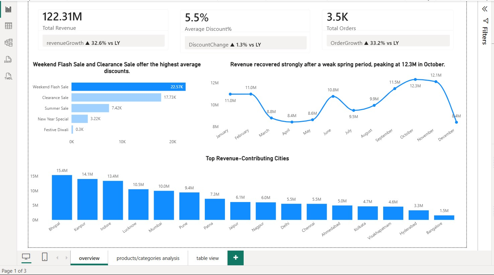
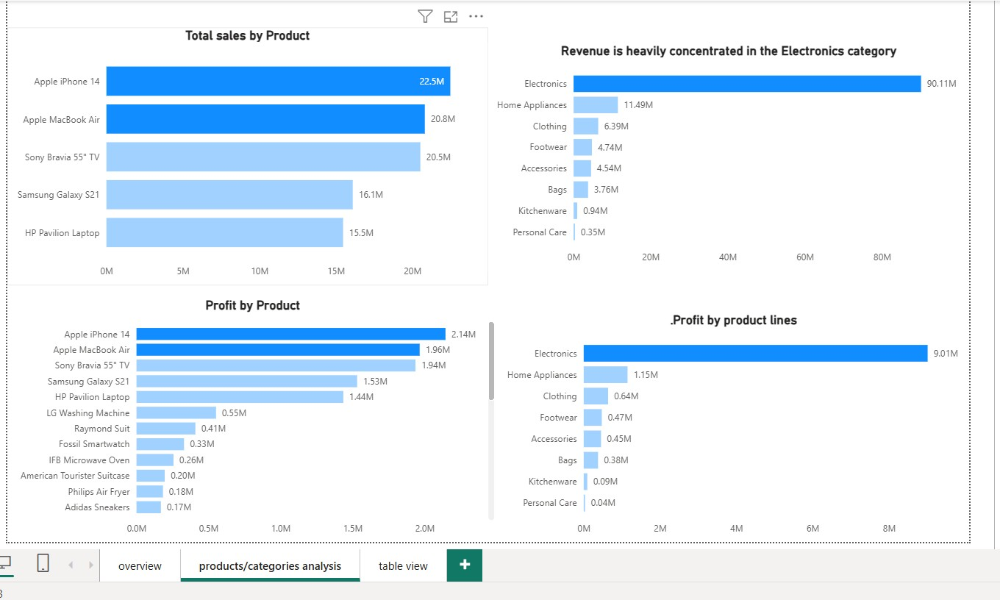
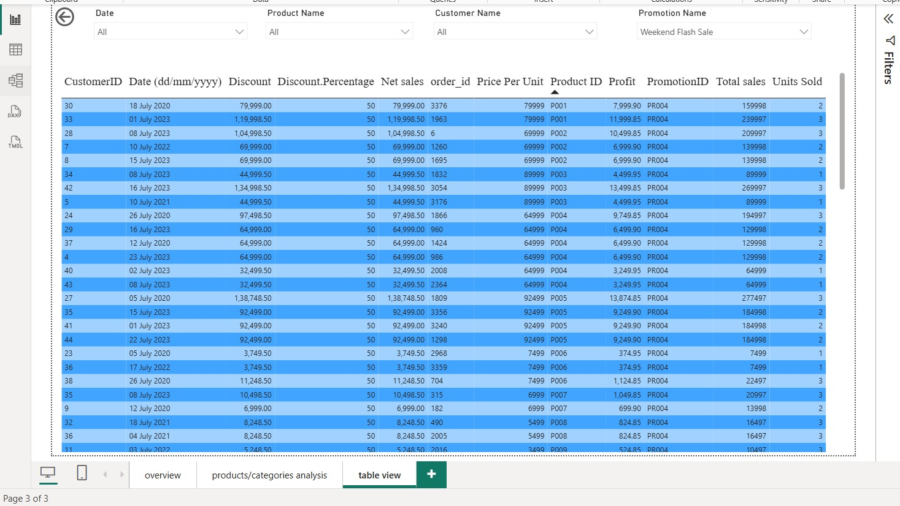

# Retail Sales Analytics Dashboard

## Project Overview

Retail businesses generate large volumes of transactional data across products, customers, promotions, and locations. However, raw sales data alone does not provide meaningful insights for decision-making.

This project develops an end-to-end Retail Sales Analytics Dashboard in Power BI to analyze sales performance, product profitability, promotion effectiveness, and geographical revenue distribution.

The dashboard enables business users to:

- Monitor revenue and order performance
- Identify top-performing products and categories
- Evaluate promotion effectiveness
- Analyze city-wise sales performance
- Support data-driven business decisions

---

## Project Highlights

- Built an end-to-end Retail Sales Analytics Dashboard using Power BI
- Designed a Star Schema data model with Fact and Dimension tables
- Created DAX measures for Revenue, Orders, Discounts, and Growth Metrics
- Performed Product, Category, Promotion, and Geographic Analysis
- Developed interactive dashboards with filters and drill-through capabilities
- Generated actionable business recommendations from sales data

---

## Business Problem

Management wants answers to the following questions:

- Which products generate the highest and lowest revenue?
- Which products contribute the most profit?
- How do sales trends change over time?
- Which promotional campaigns are most effective?
- Which cities contribute the highest revenue?
- How many orders are being generated?
- How do discounts impact revenue performance?

Without a centralized reporting solution, answering these questions requires manual analysis and significant effort.

---

## Project Objectives

The objectives of this project were:

1. Analyze product performance using sales, profit, and quantity sold.
2. Monitor revenue trends across time.
3. Evaluate promotion effectiveness and discount impact.
4. Identify top revenue-contributing cities.
5. Build an interactive dashboard for business users.
6. Create a scalable Star Schema data model.

---

## Tools & Technologies

| Tool | Purpose |
|--------|----------|
| Power BI | Dashboard Development |
| Power Query | Data Cleaning & Transformation |
| DAX | Business Metrics & Calculations |
| Excel | Source Dataset |
| Star Schema | Data Modeling |

---

## Data Workflow

```text
Raw Excel Data
      ↓
Power Query Cleaning
      ↓
Data Transformation
      ↓
Star Schema Modeling
      ↓
DAX Calculations
      ↓
Dashboard Development
      ↓
Business Insights
```

---

## Data Model

The project follows a Star Schema design.

### Fact Table

#### Fact Sales

Contains transaction-level data:

- Order ID
- Customer ID
- Product ID
- Promotion ID
- Units Sold
- Total Sales
- Discount
- Net Sales
- Profit

### Dimension Tables

#### Dim Customer

- Customer ID
- Customer Name
- City
- State
- Email ID

#### Dim Product

- Product ID
- Product Name
- Product Line
- Price Per Unit

#### Dim Promotion

- Promotion ID
- Promotion Name
- Ad Type
- Coupon Code
- Discount Percentage

#### Date Dimension

Created using CALENDARAUTO() to support time intelligence calculations.

---

## Data Preparation

The following transformations were performed using Power Query:

- Data type corrections
- Column renaming
- Removing unnecessary columns
- Handling missing values
- Data validation
- Relationship creation
- Data modeling

### Derived Metrics

#### Total Sales

```text
Total Sales = Units Sold × Price Per Unit
```

#### Discount

```text
Discount = Total Sales × Discount Percentage
```

#### Net Sales

```text
Net Sales = Total Sales − Discount
```

#### Profit

```text
Profit = Net Sales × 10%
```

> Note: Product cost information was not available in the dataset. Therefore, a fixed 10% profit margin was assumed.

---

## Key DAX Measures

### Total Revenue

```DAX
Total Revenue =
SUM('Fact table'[Net sales])
```

### Total Orders

```DAX
Total Orders =
DISTINCTCOUNT('Fact table'[order_id])
```

### Average Discount %

```DAX
Average Discount % =
AVERAGE('Fact table'[Discount.Percentage])
```

### Profit

```DAX
Profit =
SUM('Fact table'[Profit])
```

---

# Dashboard Pages

## 1. Executive Overview

Provides a high-level summary of business performance.

### KPIs

- Total Revenue
- Total Orders
- Average Discount %

### Analysis

- Monthly Revenue Trend
- Promotion Performance
- Revenue by City

### Dashboard Preview



---

## 2. Product & Category Analysis

Provides detailed product and category-level insights.

### Analysis

- Top Revenue Products
- Product Profitability
- Revenue by Product Category
- Profit by Product Category

### Dashboard Preview



---

## 3. Transaction Explorer

Provides transaction-level visibility.

### Interactive Filters

- Date
- Product Name
- Customer Name
- Promotion Name

### Metrics

- Sales
- Discount
- Net Sales
- Profit
- Units Sold

### Dashboard Preview



---

# Key Business Insights

## Product Performance

- Apple iPhone 14 generated the highest revenue.
- Apple MacBook Air and Sony Bravia TV were major revenue contributors.
- Electronics products dominated overall sales performance.

## Category Performance

- Electronics generated significantly higher revenue than all other categories.
- Personal Care and Kitchenware were the lowest-performing categories.

## Promotion Analysis

- Weekend Flash Sale offered the highest average discounts.
- Clearance Sale was the second most aggressive promotion strategy.
- Higher discounts did not always translate into higher revenue contribution.

## Geographic Insights

- Bhopal generated the highest revenue.
- Kanpur and Indore were also major contributors.
- Bangalore generated the lowest revenue among analyzed cities.

## Revenue Trends

- Revenue declined during March–May.
- Revenue recovered from June onward.
- Sales peaked during October and November.
- Seasonal demand appears stronger during the festive period.

---

# Business Recommendations

## Product Strategy

Maintain inventory availability for high-performing Electronics products while reducing dependence on a single category.

## Promotion Strategy

Evaluate promotion ROI before increasing discount levels, particularly for Weekend Flash Sale and Clearance Sale campaigns.

## Geographic Expansion

Replicate successful sales strategies used in Bhopal, Kanpur, and Indore within lower-performing cities.

## Category Growth

Develop targeted campaigns to improve performance in Personal Care and Kitchenware categories.

---

# Assumptions & Limitations

## Assumptions

- Profit margin assumed at 10%
- Promotion discounts mapped through business rules

## Limitations

- No product cost data available
- No inventory information
- No customer demographics
- No forecasting included

---

# Repository Structure

```text
Retail-Sales-Analytics-Dashboard/
│
├── visuals/
│   ├── Dashboard_overview.jpg
│   ├── products_category_analysis.jpg
│   └── transaction_table_view.jpg
│
├── Retail_Sales_Dashboard.pbix
├── README.md
```

---

# Deliverables

- Power BI Dashboard (.pbix)
- Star Schema Data Model
- DAX Measures
- Business Insights Report
- Project Documentation

---

# Future Enhancements

- Profit Margin Analysis using actual cost data
- Customer Segmentation
- Sales Forecasting
- Customer Lifetime Value (CLV)
- Geographic Mapping Dashboard

---

# About Me

**Jitender Yadav**

Data Analytics Enthusiast passionate about transforming raw data into business insights.

### Skills

- Excel
- SQL
- Power BI
- DAX
- Statistics
- Data Visualization

### Connect With Me

- LinkedIn: Add your LinkedIn URL
- GitHub: https://github.com/jitendera-code

---
